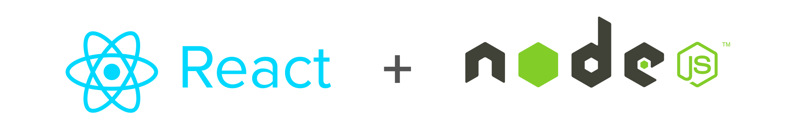

<b>Hi I'm Jonatan</b>

I'm a full stack software engineer who learns quickly and adapts to new day-to-day technologies, I really like the Front End, this has allowed me to have experience as a good client-side developer, but also with great knowledge of the Backend to face greater challenges.

<b>I'm currently learning:</b>

<!--
**MAZTRO/MAZTRO** is a ✨ _special_ ✨ repository because its `README.md` (this file) appears on your GitHub profile.

Here are some ideas to get you started:

- 🔭 I’m currently working on ...
- 🌱 I’m currently learning ...
- 👯 I’m looking to collaborate on ...
- 🤔 I’m looking for help with ...
- 💬 Ask me about ...
- 📫 How to reach me: ...
- 😄 Pronouns: ...
- ⚡ Fun fact: ...
-->
